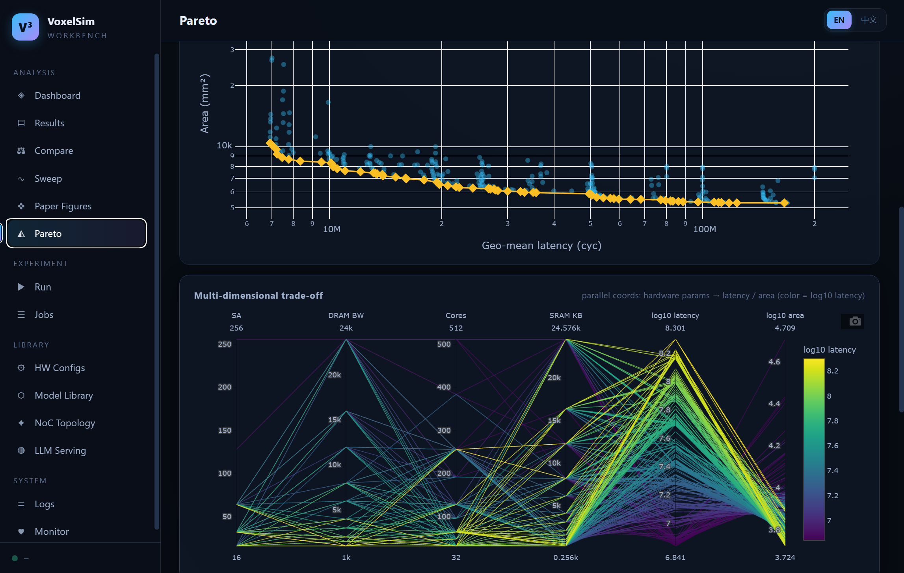

# VoxelSim Workbench

[English](README.md) | **中文**

VoxelSim(3D 堆叠 AI 芯片 LLM 推理模拟器)的一体化 Web 工作台:结果检索、深度分析、
论文图表复现、在线启动模拟/扫描/DSE/热分析、任务管理、硬件/模型/NoC 资源库与系统监控。



## 快速开始

```bash
# 项目根目录(venv 中需有 flask / pyyaml;测试需要 pytest)
venv/bin/python web_profiler/app.py
# 或
web_profiler/launch.sh
```

访问 **http://127.0.0.1:5000**。环境变量:`FLASK_HOST` / `FLASK_PORT` / `FLASK_DEBUG=1` /
`WEB_PROFILER_MAX_WORKERS`(并行模拟槽位,默认 2)。

## 功能地图

| 页面 | 路由 | 说明 |
|---|---|---|
| 总览 | `#/dashboard` | 结果分布(donut/bar)、最新结果 |
| 结果浏览 | `#/results` | 12 维过滤 + 全文搜索 + 分页 + 排序 + CSV 导出(3080+ 条) |
| 结果详情 | `#/result?id=` | 指标卡、静/动态能耗分解、算子甘特(窗口化)、算子类型分解(Fig.20 风格)、Top 功耗、overlap、复现命令、trace.json/CSV 下载 |
| 配置对比 | `#/compare` | 2–12 条结果并排:small-multiples 指标图 + best/worst 高亮明细表 |
| 参数扫描 | `#/sweep` | 任意参数 × 任意指标折线(mean/min/max 误差带,自动 log 轴),点可下钻 |
| 论文图表 | `#/paper` | Fig.10–20 一键复现(通用 panel 渲染器,支持 mode/model 参数) |
| Pareto 探索 | `#/pareto` | DSE 前沿散点/连线、平行坐标、前沿点表 |
| 运行模拟 | `#/run` | **挡位滑钮多选**(模型/实现 chip + 10 个参数挡位)→ 笛卡尔积展开成 1–64 个模拟;DSE、热分析三个标签页 |
| 任务中心 | `#/jobs` | 队列/进度/取消/删除,日志实时流(增量 offset 轮询) |
| 硬件配置 | `#/hwconfigs` | 71 个配置检索、JSON 查看、在线新建(严格校验) |
| 模型库 | `#/models` | 24 个模型卡片 + 算子浏览器(搜索/类型过滤/分页) |
| NoC 拓扑 | `#/noc` | 12 张距离表热力图(>256 自动降采样)+ avg/max hops |
| LLM Serving | `#/serving` | llmservingsim profile 曲线与 meta |
| 日志查看 | `#/logs` | test_logs/root/dse/thermal 分类,字节窗口分页、tail 轮询、关键词高亮 |
| 系统监控 | `#/system` | CPU/内存/磁盘、RAM 时间线(10s 自动刷新) |

## 架构

```
web_profiler/
├── app.py                 # 入口(thin launcher → server.create_app)
├── launch.sh              # 启动脚本(自动用 venv)
├── requirements.txt
├── server/                # Flask 后端(蓝图)
│   ├── __init__.py        #   create_app() 应用工厂
│   ├── config.py          #   路径/常量
│   ├── parsers.py         #   日志解析(纯函数)
│   ├── index.py           #   结果索引 + 指标缓存
│   ├── classify.py        #   算子分类(FFN/Attn/Other,移植自 draw_op_breakdown.py)
│   ├── commands.py        #   模拟/DSE/热分析命令构建 + hw_config 生成(绝不覆盖)
│   ├── jobs.py            #   JobManager(队列/并发/取消/持久化)
│   ├── api_results.py     #   /api/results /api/result/*
│   ├── api_analysis.py    #   /api/sweep /api/compare /api/pareto /api/paper/*
│   ├── api_catalog.py     #   /api/hwconfigs /api/models /api/noc /api/serving
│   ├── api_system.py      #   /api/system /api/logs
│   └── api_jobs.py        #   /api/jobs*
├── templates/index.html   # SPA shell(侧边栏 + 路由)
├── static/
│   ├── css/app.css        # 设计系统(暗色主题)
│   ├── js/core.js         # 框架:hash 路由 + API 客户端 + UI 组件库
│   ├── js/pages/*.js      # 15 个页面模块(各 App.route 自注册)
│   └── vendor/plotly-2.35.2.min.js
├── runtime/               # 运行时状态(指标缓存、jobs/*.json|*.log)
└── tests/                 # pytest 套件
```

约定:
- 结果 id = 相对项目根的 log 路径;web 启动的模拟落在 `results/logs_web/`。
- 后端只新增文件,从不修改/覆盖项目已有文件(hw_config 重名且内容不同会自动加 `web_` 前缀)。
- 中断恢复:服务重启时未完成的 job 标记为 `interrupted`,绝不自动重跑。

## 测试

```bash
venv/bin/python -m pytest web_profiler/tests/ -q    # 159 个用例
```

## API 速览

`GET /api/overview` · `GET /api/filters` · `GET /api/metrics_meta` ·
`GET /api/results?page=&page_size=&with_metrics=1&sort=&q=` ·
`GET /api/result/detail|operators|op_energy|op_breakdown|top_power|overlap|reproduce|export.csv|trace.json?id=` ·
`GET /api/sweep?x=&metric=&group=` · `GET /api/compare?ids=` ·
`GET /api/pareto?mode=` · `GET /api/paper/fig10..fig20` ·
`POST /api/index/rebuild` ·
`GET|POST /api/jobs` · `GET /api/jobs/<id>/log?offset=` · `POST /api/jobs/<id>/cancel|delete` ·
`GET|POST /api/hwconfigs` · `GET /api/models/<name>/ops` · `GET /api/noc/tables/<topo>/<n>` ·
`GET /api/serving/profile?path=` · `GET /api/logs/view?path=` ·
`GET /api/system/host` · `GET /api/system/ram_timeline`
